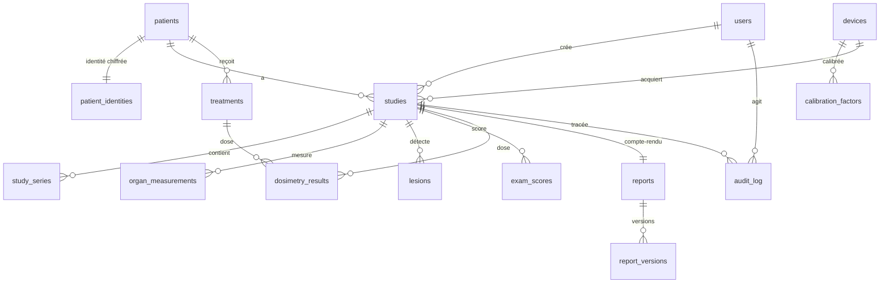

# 04 — Modèle de données

> Schéma logique de la base. À implémenter en SQLAlchemy. Les contraintes de confidentialité (séparation des identifiants, chiffrement) sont détaillées dans `05_CONTRAINTES_SECURITE.md` — ce document les reflète mais la sécurité fait foi.

---

## 1. Principe de confidentialité dès le modèle

Les **identifiants patient ne sont pas mêlés aux données cliniques**. On distingue :
- les **données cliniques** (examens, mesures, scores, doses, CR) → rattachées à un **pseudonyme** ;
- l'**identité réelle** (nom, date de naissance, ID) → stockée **chiffrée**, dans une table à part, accès restreint, utilisée uniquement pour la ré-identification **locale** au moment de l'export.

---

## 2. Entités

### `users`
| Champ | Type | Note |
|---|---|---|
| id | UUID (PK) | |
| email | text, unique | |
| password_hash | text | jamais en clair |
| full_name | text | |
| role | enum | `medecin`, `physicien`, `manipulateur`, `admin` |
| created_at | timestamptz | |

### `patients` (pseudonymisé)
| id | UUID (PK) |
| pseudonym | text, unique | code interne non signifiant |
| created_at | timestamptz |

### `patient_identities` (chiffré, accès restreint)
| id | UUID (PK) |
| patient_id | UUID (FK → patients) |
| identity_encrypted | bytea | nom + date de naissance + ID, **chiffré** |
| created_at | timestamptz |
> Table isolée, jamais exposée par l'API d'analyse ni envoyée à une API externe.

### `devices` (caméras)
| id | UUID (PK) |
| name | text |
| model | text |
| site | text |

### `calibration_factors`
| id | UUID (PK) |
| device_id | UUID (FK → devices) |
| isotope | enum | `Tc-99m`, `I-123`, `I-131`, `In-111`, `Lu-177` |
| value | numeric | sensibilité (coups/s par MBq) |
| unit | text | |
| calibrated_at | timestamptz |

### `studies` (un examen)
| id | UUID (PK) |
| patient_id | UUID (FK → patients) |
| exam_type | enum | `bone`, `myocardial_spect`, `mibg`, `octreotide`, `parathyroid`, `lung_vq` |
| status | enum | cf. statuts du pipeline (`uploaded` … `ready`, `error`) |
| isotope | enum | |
| radiopharmaceutical | text | |
| injected_activity_mbq | numeric | activité injectée **nette** |
| injection_time | timestamptz | |
| acquisition_time | timestamptz | |
| device_id | UUID (FK → devices, nullable) |
| error_message | text, nullable | |
| created_by | UUID (FK → users) |
| created_at | timestamptz |

### `study_series` (fichiers d'un examen)
| id | UUID (PK) |
| study_id | UUID (FK → studies) |
| kind | enum | `ct`, `spect` |
| storage_path | text | référence stockage objet |
| anonymized | bool | |
| time_point | timestamptz, nullable | pour la dosimétrie multi-temps |
| metadata | jsonb | tags DICOM utiles (dé-identifiés) |

### `organ_measurements`
| id | UUID (PK) |
| study_id | UUID (FK → studies) |
| organ_name | text | nom TotalSegmentator |
| snomed_code | text, nullable | interopérabilité |
| volume_ml | numeric | |
| mean_intensity | numeric, nullable | |
| activity_mbq | numeric, nullable | |
| concentration_mbq_ml | numeric, nullable | |
| pct_injected_activity | numeric, nullable | %AI |
| segmentation_corrected | bool | masque corrigé par le médecin ? |

### `lesions` (foyers)
| id | UUID (PK) |
| study_id | UUID (FK → studies) |
| anatomical_ref | text | ex. « 8e côte droite » (via CT segmenté) |
| intensity | numeric, nullable | |
| ratio | numeric, nullable | lésion/bruit de fond |
| size_mm | numeric, nullable | |
| is_physiological | bool | issu de l'atlas physiologique |
| notes | text, nullable |

### `exam_scores`
| id | UUID (PK) |
| study_id | UUID (FK → studies) |
| score_type | enum | `krenning`, `curie`, `siopen`, `pioped`, `bsi`, `lvef`, `sss`, `srs`, `sds`, `tid` |
| value | text | valeur (nombre, catégorie, ou « 4/4 ») |
| details | jsonb, nullable | sous-scores, segments… |

### `dosimetry_results`
| id | UUID (PK) |
| study_id | UUID (FK → studies, nullable) | ou rattaché à un traitement |
| treatment_id | UUID (FK → treatments, nullable) |
| target | text | organe ou lésion |
| absorbed_dose_gy | numeric | |
| uncertainty_gy | numeric, nullable | **toujours afficher l'incertitude** |
| tia | numeric, nullable | activité cumulée |
| method | enum | `multi_timepoint`, `single_timepoint` (STP = approximatif) |
| engine | text | `mirdcalc`, `olinda` |
| model_version | text | traçabilité |

### `treatments` (suivi thérapeutique multi-temps — avancé)
| id | UUID (PK) |
| patient_id | UUID (FK → patients) |
| radiopharmaceutical | text | ex. Lu-177 DOTATATE |
| cycle | int | |
| administered_activity_mbq | numeric |
| administered_at | timestamptz |

### `reports`
| id | UUID (PK) |
| study_id | UUID (FK → studies) |
| status | enum | `draft`, `edited`, `validated` |
| validated_by | UUID (FK → users, nullable) |
| validated_at | timestamptz, nullable |
| created_at | timestamptz |

### `report_versions` (historique — audit)
| id | UUID (PK) |
| report_id | UUID (FK → reports) |
| version_no | int |
| kind | enum | `ai_draft`, `edited`, `validated` |
| content | text | le compte-rendu |
| ai_model_version | text, nullable | quelle version a généré le brouillon |
| author | UUID (FK → users, nullable) | null si IA |
| created_at | timestamptz |
> On conserve **le brouillon IA ET les versions éditées** (preuve, audit, amélioration).

### `audit_log` (append-only)
| id | UUID (PK) |
| user_id | UUID (FK → users, nullable) |
| study_id | UUID (FK → studies, nullable) |
| action | text | ex. `study.upload`, `segmentation.correct`, `report.validate`, `export.pdf` |
| details | jsonb | |
| ip | inet, nullable |
| created_at | timestamptz |

---

## 3. Relations (vue d'ensemble)

---

## 4. Énumérations clés (à centraliser)

- **role** : `medecin · physicien · manipulateur · admin`
- **exam_type** : `bone · myocardial_spect · mibg · octreotide · parathyroid · lung_vq`
- **study.status** : `uploaded · anonymizing · separating · converting · segmenting · registering · quantifying · dosimetry · analyzing · generating_report · ready · error`
- **series.kind** : `ct · spect`
- **isotope** : `Tc-99m · I-123 · I-131 · In-111 · Lu-177`
- **score_type** : `krenning · curie · siopen · pioped · bsi · lvef · sss · srs · sds · tid`
- **dosimetry.method** : `multi_timepoint · single_timepoint`
- **report.status** : `draft · edited · validated`
- **report_version.kind** : `ai_draft · edited · validated`

---

## 5. Règles de cohérence

- Une mesure chiffrée n'existe pas sans unité explicite (mL, MBq, Gy, %).
- Toute `dosimetry_result` en `single_timepoint` est marquée comme **estimation approximative** côté UI.
- `model_version` / `ai_model_version` obligatoires sur tout résultat produit par un modèle → reproductibilité.
- Aucune écriture ne contourne le journal d'audit pour les actions sensibles (upload, correction, validation, export, suppression).
- Suppression des `study_series` brutes (DICOM) après traitement (cf. politique de rétention).
